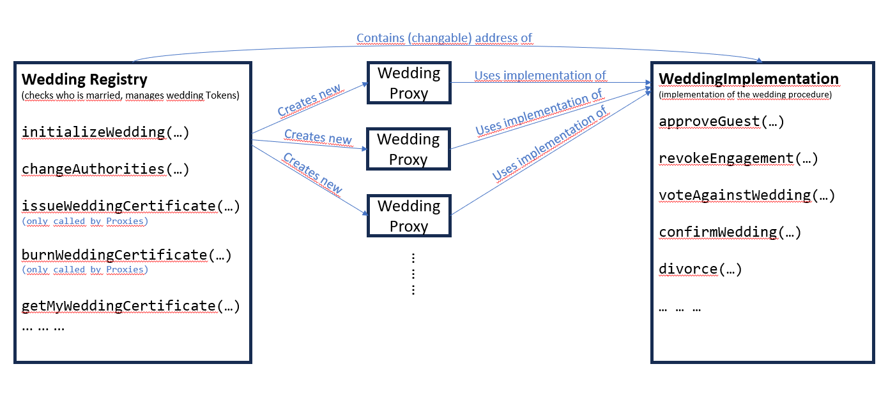
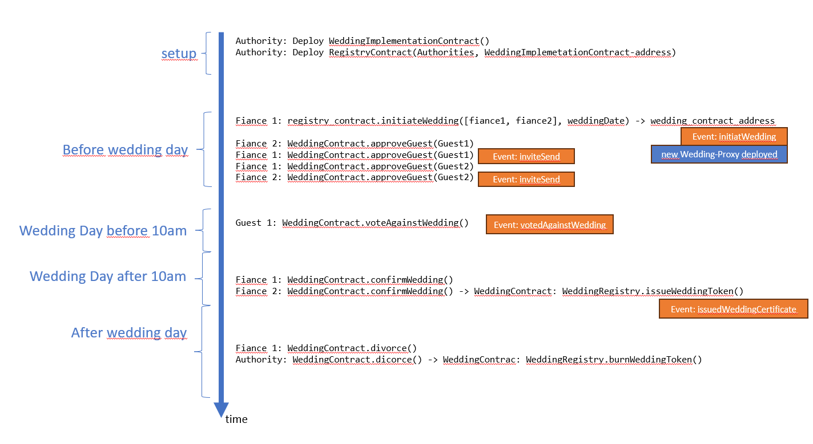

# Assignment 3 - Wedding Smart Contract

## Repo contents
This repository is structured as a brownie project. 
The `contracts` folder contains the smart contracts solidity code. 
The `scripts` folder contains scripts used to deploy the smart contracts and showcase their functionality.
The `tests` folder contains the tests for the smart contract.
Even though we used a brownie project in order to allow for easier testing, the smart contracts in the `contracts` folder can be deployed and tested using `Remix` as well.

## Design Description


Two distinct smart contracts are used in this project.
One is the `Wedding` contract, which contains the logic for the wedding procedure itself.
This includes the ability to initiate a wedding, revoke a wedding before the wedding date, invite and approve guests, let guests vote against the wedding, and finally, let the fiances agree to get married (and also get divorced afterward).
The other contract is the `WeddingRegistry`.
This contract is used to keep track of all the weddings that have been initiated and might get divorced.
This is done by using a so-called contract-factory pattern, where the `WeddingRegistry` contract is used to deploy new `Wedding` contracts.
This means that someone who wants to get married needs to call the `initiateWedding` function on the `WeddingRegistry` contract, which will then deploy a new `Wedding` contract.
Every step on the wedding procedure is then done on the `Wedding` contract, and only in the end, when the finances agree to get married, the `WeddingRegistry` contract gets called back by the `Wedding` contract to register the wedding.

The `WeddingRegistry` contract also issues ERC721 tokens for each wedding after the wedding has been registered.
The tokens are owned by the corresponding wedding contract and can be used to prove that a wedding has taken place.
The registry also tracks which address is a fiance in which wedding.
Therefore we can check whether a given address is a fiance in a wedding by simply checking if the address is associated with a wedding token.
Using OpenZeppelin's `ERC721` contract, it is very easy to implement this functionality and ensure unique, non-fungible tokens.
OpenZeppelin's `ERC721` contract also allows us to associate metadata with each token, which we use to store the wedding date and the names of the finances.
However, in favor of keeping sensitive data off-chain, we do not store any additional data on-chain.
Everything which should be relevant for a wedding registry is whether a person (or better, an address) is a fiance in a wedding or not.

The big downside of using the described factory-pattern is that for each wedding a new contract is deployed, which is very expensive.
This was solved by deploying `Proxy` contracts from the `WeddingRegistry` contract instead of `Wedding` contracts directly.
These `Proxy` contracts do not contain any wedding logic themselves, but instead forward all calls to a `Wedding`-Implementation contract.
Therefore we need to deploy the `Wedding`-Implementation contract only once, and then deploy a small and cheap `Proxy` contract for each wedding.
Using OpenZeppelin's `ERC1967Proxy` contract, this can be done in a very simple way without having to write its own `Proxy` contract.

Using this Contract-factory pattern together with the `ERC1967Proxy` contract has some significant advantages:
- The `Wedding`-Implementation contract can be upgraded without having to redeploy the registry. This can be extremely helpful if the "laws" for getting married change or if a bug is found in the implementation. An authority can simply update the address of the `Wedding`-Implementation contract in the registry, and all future weddings will use the new implementation.
- We achieve a nice separation of concerns. The `WeddingRegistry` contract is only responsible for keeping track of all weddings, while the `Wedding`-Implementation contract is only responsible for the wedding logic. This makes the code easier to read and understand.
- The overhead of deploying a new contract for each wedding is reduced to a minimum since the `Proxy` contracts are very small and cheap to deploy. Also we do not need expensive lookups for all relevant data in the `WeddingRegistry` contract as all weddings have their 'own' contract.


## Usage of the smart contracts
### Deploying the contracts
First the `Wedding`-Implementation contract needs to be deployed. This can be done by any address.
Then the `WeddingRegistry` contract needs to be deployed. When deploying the `WeddingRegistry` contract, the address of the `Wedding`-Implementation contract needs to be passed as a constructor argument as well as a list of addresses of the authorities.

### Marrying with the smart contracts

In order to get 2 or more people married, the `initiateWedding` function on the `WeddingRegistry` contract needs to be called with the addresses of the fiances and the wedding date as unix timestamp as arguments.
Note that the wedding dates needs to be in the future and must be at least 1 day in the future.
This will deploy a new `Proxy` contract which will forward all calls to the `Wedding`-Implementation contract.
The registry will also check that no fiance is already married in another wedding.
The fiances (and later also invited guests) will from now on interact with this `Proxy` contract to get through all the steps of the wedding procedure.
Any of the fiances can call the `approveGuest` function on the `Proxy` contract to propose a guest to be invited to the wedding.
The other fiance then needs to call the `approveGuest` function as well to approve the guest.
Once all guests have been approved, an event will be emmitted to inform the guests that they are invited.
The wedding day itself is divided into 2 time intervals.
The first interval is the time between the beginning of the wedding day and 10 am on the wedding day.
In this time interval, the guests can vote against the wedding by calling the `voteAgainstWedding` function on the `Proxy` contract.
If more than 50% of the guests vote against the wedding, the wedding will be canceled and no function calls on the `Proxy` contract will be possible anymore.
After this period has ended the fiances have to confirm that they still want to get married by calling the `confirmWedding` function on the `Proxy` contract.
If all fiances have called this function, the wedding is registered in the `WeddingRegistry` contract and a new ERC721 token is issued to the `Proxy` contract.
After the wedding day is over the fiance can also divorce by calling the `divorce` function on the `Proxy` contract.
Once either 2 of the spouses or 1 spouse and 1 authority have called the `divorce` function, the wedding is removed from the `WeddingRegistry` contract and the ERC721 token is burned.
Furthermore, the `WeddingRegsitry` contains some functions to get information about the wedding status of a calling address and the associated token.

### Example script
The `scripts` folder contains an example of how a typical interaction with the smart contracts could look like.
The script utilizes brownie's `console` functionality to interact with the smart contracts.
This makes it possible to call the contract from different addresses and timejump to the wedding day.

### Tokens
The Wedding Tokens are issued by the `WeddingRegistry` contract after the wedding has been registered.
We use the `ERC721UCIStorage` contract from OpenZeppelin to issue the tokens.
The owner of the token is the `Proxy` contract of the wedding.
The `WeddingRegistry` also contains a mapping from fiance addresses to Wedding contract addresses.
In this way we can alway associate all fiances to a wedding and its token.
The token ID is a incrementing counter which is stored in the `WeddingRegistry` contract.
The token URI is a string which can contain arbitrary data about the wedding.
However, since the relevant data for a wedding is already stored in the `WeddingRegistry` contract and the `Proxy` contract, we do not store any additional data on-chain.
The URI is still there to showcase how additional information could be stored on-chain.

## Brownie project setup
In order to run the test suite and scripts, you need to set up this repository as a brownie project.
To do so, you need to install `brownie` and `ganache-cli`.
Note that `brownie` requires python 3.9, so it is recommended to use a virtual conda environment for simply changing the python version.
```bash
conda create -n wedding_env python=3.9
conda activate wedding_env
```
Then you install the required packages.
```bash
pip install eth-brownie
npm install -g ganache-cli
```
Then, you need to clone this repository and cd into it and install the OpenZeppelin contracts.
```bash
git clone
cd TTM4195
npm install .
```
Finally, you need to initialize the brownie project.
```bash
brownie init -f
```
Then you can run the tests and scripts using the brownie command.
```bash
brownie test
brownie run scripts/<script_name>.py
```